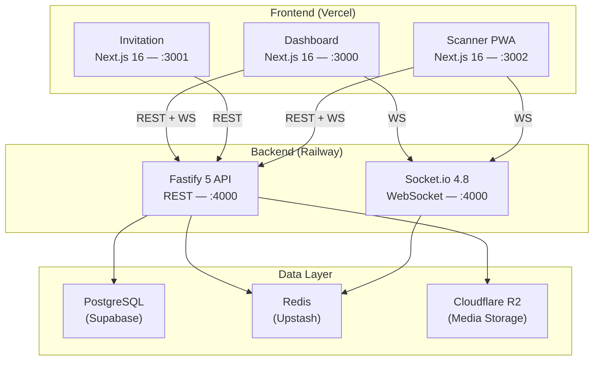
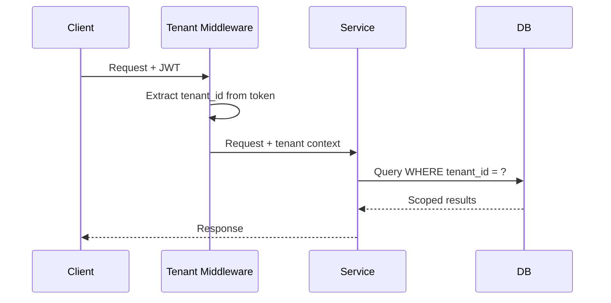
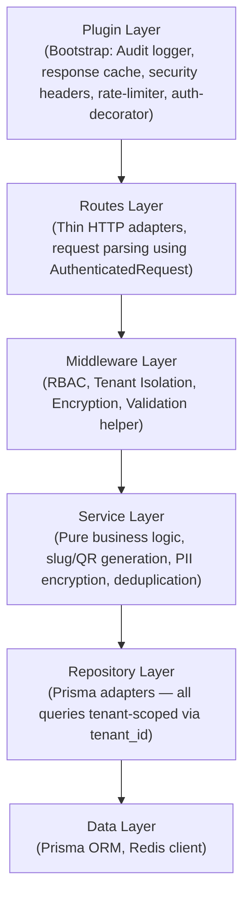
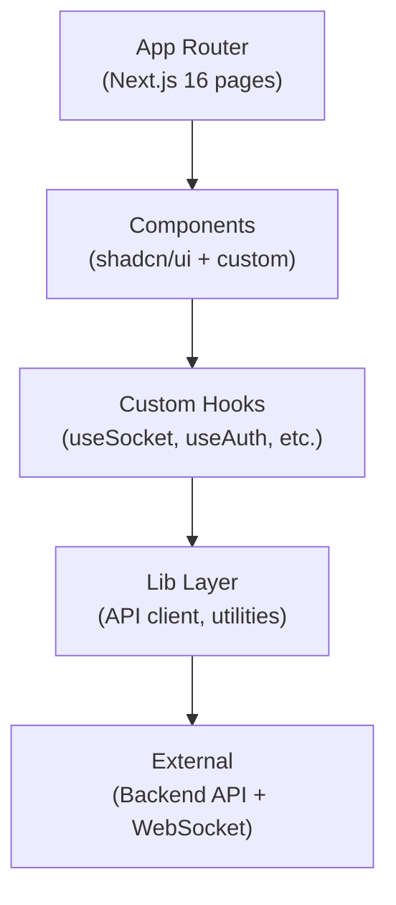
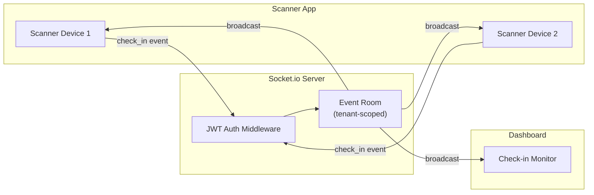
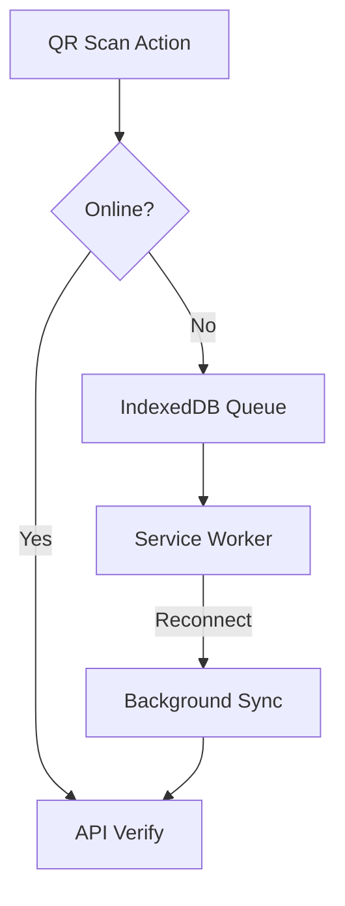
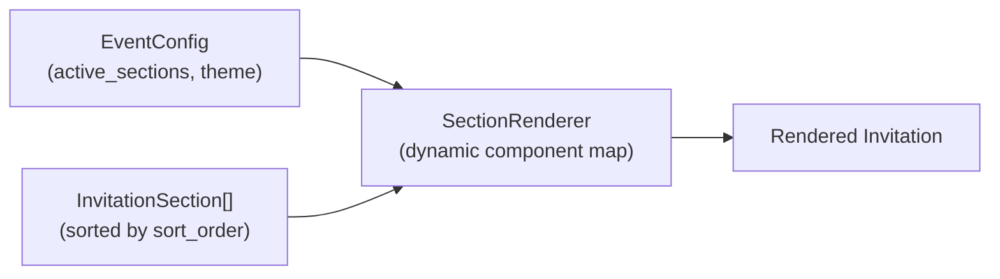
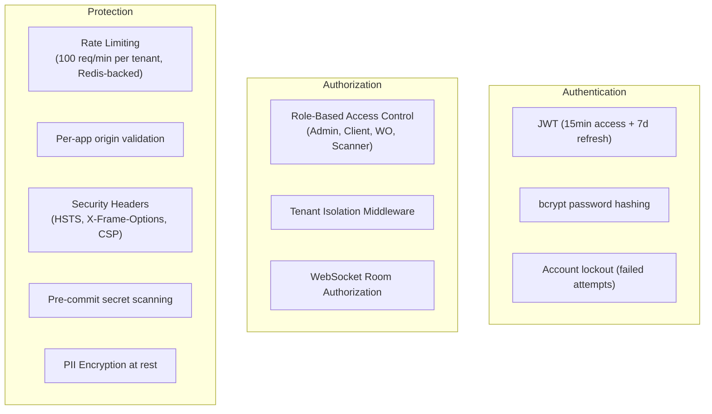
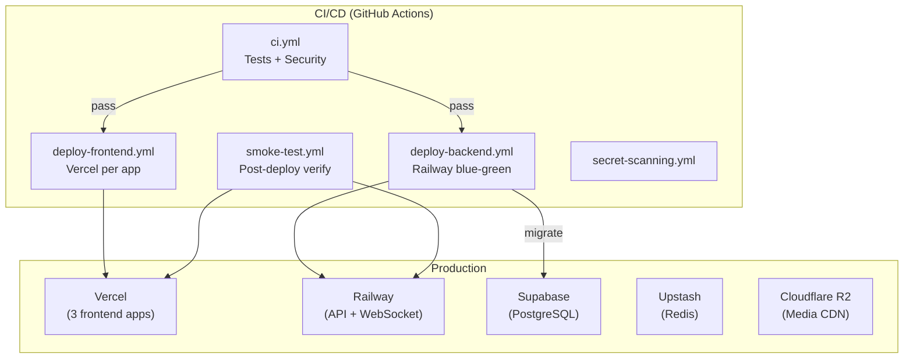

# Architecture

## System Overview

## Architectural Patterns

### Multi-Tenant Isolation

Every database table includes `tenant_id`. All queries are scoped at the service layer via middleware.

### Layered Backend Architecture

The backend follows a strict 4-layer architecture with cross-cutting plugins for performance and security.

**Domain coverage**: All core domains (Guest, Check-in, RSVP, CMS, Events, Admin) have been migrated to the full **Route → Service → Repository** stack. Direct Prisma calls from services are deprecated.

**Request Lifecycle**:

1.  **Bootstrap**: Plugins register global hooks (logger, rate-limit).
2.  **Context**: `auth` plugin decorates request with `user` and `tenant_id`.
3.  **Unified Auth**: The `AuthUser` interface in `@wedding/shared` is the single source of truth for user profile data (id, tenant_id, role, email, name).
4.  **Entry**: Routes use `AuthenticatedRequest` to access type-safe user context.
5.  **Enforcement**: Middleware applies RBAC and validates input against Zod schemas.
6.  **Logic**: Services execute business rules without database awareness.
7.  **Persistence**: Repositories interact with Prisma using explicit types (Zero-Cast policy).

### Frontend Architecture (per app)

### Real-Time Architecture

**WebSocket Events**: `guest_checked_in`, `rsvp_updated`, `go_show_added`, `stats_updated`

### Offline-First (Scanner PWA)

- Offline scans stored in IndexedDB
- Auto-sync within 30 seconds of reconnection
- Conflict resolution: server timestamp wins

### CMS-Driven Rendering (Invitation)

14 configurable sections rendered dynamically based on `InvitationSection` records:

## Security Architecture

> [!NOTE]
> **Production 2-Role System**: For the MVP in production, the RBAC model is simplified to **Admin** and **Client** roles. The **WO** and **Scanner Operator** roles are preserved in the TypeScript type definitions for backward compatibility, but they are denied access to all specific system features (except `ALL_ROLES`). The **Client** role now has full scanner access (QR scan verification and device registration).

## Deployment Architecture

**Blue-Green Deployment**: Backend deploys to inactive environment, health-checked for 3 minutes (3 consecutive successes), then traffic swaps. Auto-rollback on failure.

## Key Design Decisions

| Decision                                | Rationale                                               |
| --------------------------------------- | ------------------------------------------------------- |
| Single Redis instance (cache + pub/sub) | ≤500 guests, pub/sub traffic negligible                 |
| Single API instance (no clustering)     | 500 guests won't saturate single Fastify process        |
| No staging environment                  | Validation via Vercel previews + CI pipeline            |
| Room-based WebSocket                    | Data isolation per event without Redis adapter overhead |
| Prisma over raw SQL                     | Type-safe queries, schema-first migrations              |
| Next.js App Router                      | RSC for invitation performance, shared layout patterns  |
| PWA for Scanner                         | Offline-first requirement for venue reliability         |
