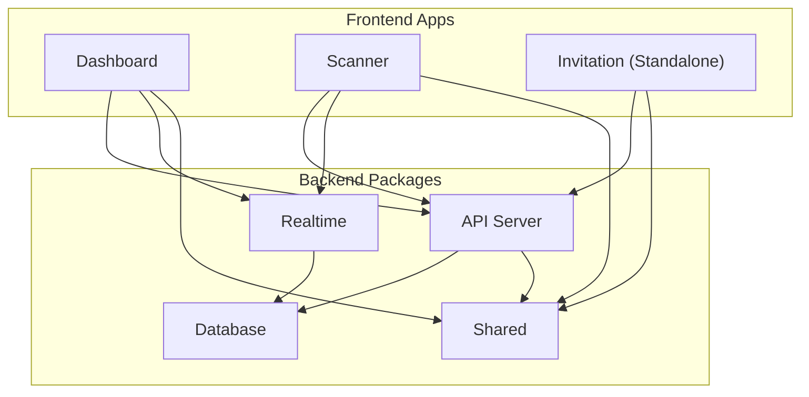
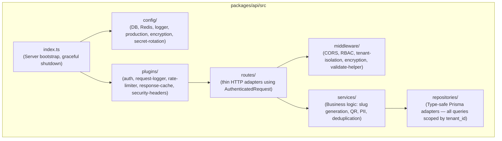
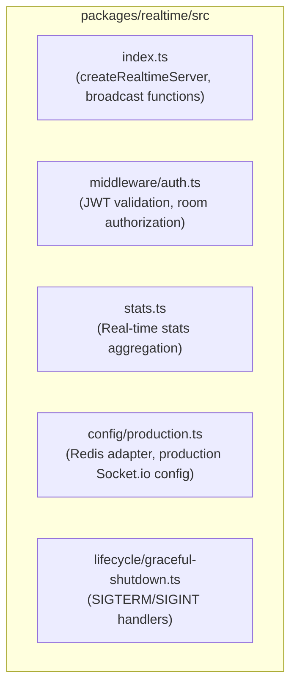
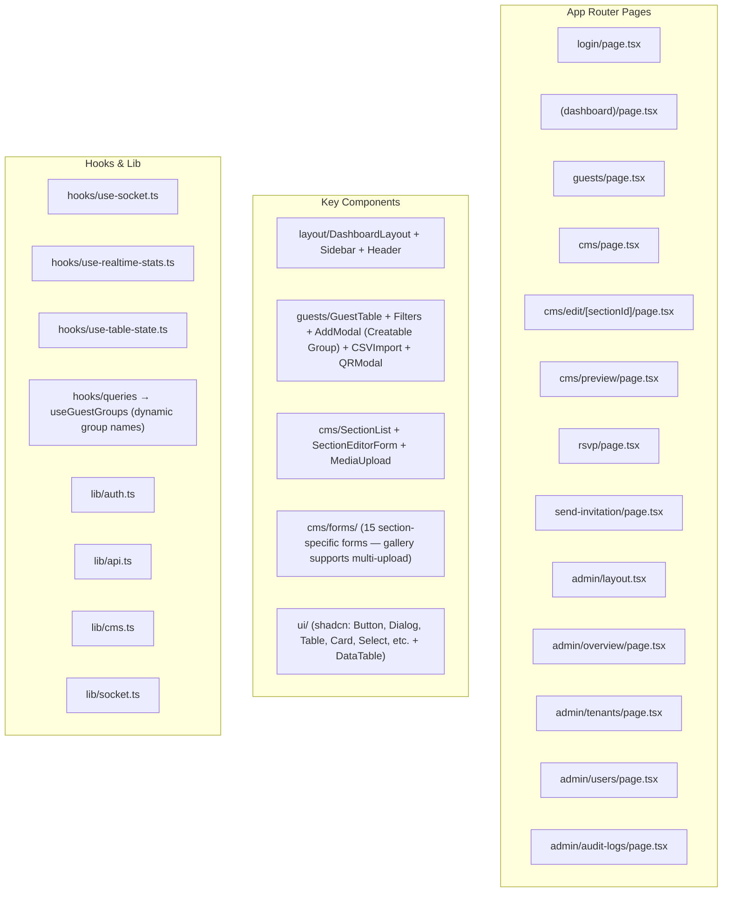
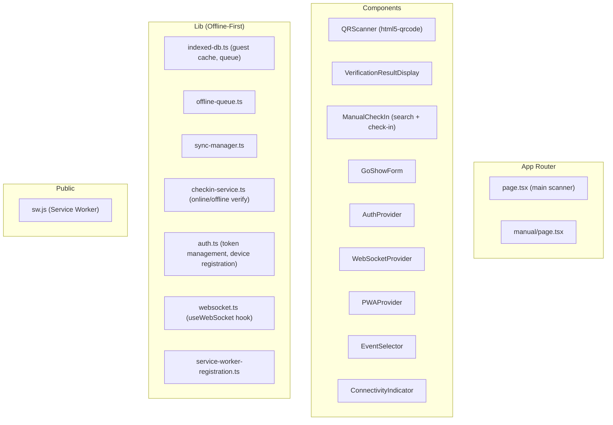

# Components

## Component Map

## Backend Components

### API Server (`packages/api`)

The central backend service handling all REST endpoints and coordinating business logic.

#### Services

| Service                     | File                                                 | Responsibility                                                                       |
| --------------------------- | ---------------------------------------------------- | ------------------------------------------------------------------------------------ |
| `AuthService`               | `auth/auth.service.ts`                               | Login, JWT generation/verification, password hashing, token refresh, account lockout |
| `GuestService`              | `guest/guest.service.ts`                             | CRUD guests, QR code generation, encrypted payloads, slug generation                 |
| `CheckInService`            | `checkin/checkin.service.ts`                         | QR verification, manual check-in, go-show registration, duplicate detection          |
| `RsvpService`               | `rsvp/rsvp.service.ts`                               | RSVP submission and retrieval                                                        |
| `CMSService`                | `cms/cms.service.ts`                                 | Section CRUD, sort order management, toggle active state                             |
| `EventService`              | `event/event.service.ts`                             | Event creation with default sections and theme                                       |
| `InvitationDeliveryService` | `invitation-delivery/invitation-delivery.service.ts` | Single invitation sending (WhatsApp), message template and delivery status tracking  |
| `ScannerDeviceService`      | `scanner-device/scanner-device.service.ts`           | Device registration, lane assignment, heartbeat, max 2 per event                     |
| `MediaUploadService`        | `media-upload/media-upload.service.ts`               | File validation, virus scanning, cloud storage upload                                |
| `StorageService`            | `storage/storage.ts`                                 | R2 client, signed URLs, tenant storage quota enforcement                             |
| `GuestImportService`        | `guest-import/guest-import.service.ts`               | CSV parsing, bulk import (max 2000 rows), deduplication                              |
| `AdminService`              | `admin/admin.service.ts`                             | Platform admin: platform KPIs, tenant management, user listing, password resets      |

#### Repositories

| Repository                | File                        | Responsibility                                   |
| ------------------------- | --------------------------- | ------------------------------------------------ |
| `PrismaGuestRepository`   | `guest/guest.repository.ts` | Type-safe Prisma adapter for guests and QR codes |
| `PrismaCheckInRepository` | `checkin.repository.ts`     | Manual and QR-based check-in persistence         |
| `PrismaCMSRepository`     | `cms.repository.ts`         | Section content and sort-order management        |
| `PrismaRsvpRepository`    | `rsvp.repository.ts`        | Guest RSVP state persistence                     |
| `PrismaAdminRepository`   | `admin.repository.ts`       | Platform-wide stats and tenant/user management   |

#### Middleware Stack

| Middleware         | Purpose                                                | Path                                              |
| ------------------ | ------------------------------------------------------ | ------------------------------------------------- |
| `CORS`             | Per-app origin validation                              | `cors/cors.middleware.ts`                         |
| `RBAC`             | Role-based access enforcement                          | `rbac/rbac.middleware.ts`                         |
| `Tenant Isolation` | Extracts `tenant_id` from JWT                          | `tenant-isolation/tenant-isolation.middleware.ts` |
| `Encryption`       | Transparent PII encryption/decryption                  | `encryption/encryption.ts`                        |
| `Validate`         | Unified input validation helper                        | `validate.ts`                                     |
| `Media Upload`     | File validation and virus scanning                     | `media-upload/media-upload.middleware.ts`         |
| `Input Validation` | Legacy Zod middleware (migrating to `validate` helper) | `input-validation/input-validation.middleware.ts` |

#### Plugins

| Plugin             | Purpose                                                                    |
| ------------------ | -------------------------------------------------------------------------- |
| `auth`             | Registers `authenticate` decorator and enriches logger with `tenant_id`    |
| `request-logger`   | Structured tracing by adding unique `request_id` to all logs               |
| `rate-limiter`     | Standardized categorical rate limiting (general, auth, scanner) with Redis |
| `response-cache`   | Symbol-based caching with pattern invalidation on successful writes        |
| `audit-logger`     | Auto-log sensitive operations using `Prisma.InputJsonValue`                |
| `security-headers` | Production security hardening (HSTS, CSP-ready, XFO)                       |

### Realtime Server (`packages/realtime`)

**Broadcast Functions**: `broadcastCheckIn`, `broadcastRsvpUpdate`, `broadcastGoShow`, `broadcastStats`

### Database (`packages/db`)

| Component              | Purpose                                           |
| ---------------------- | ------------------------------------------------- |
| `prisma/schema.prisma` | 12 models, 10 enums, multi-tenant schema          |
| `prisma/seed.ts`       | Demo data seeding (admin + scanner users)         |
| `src/client.ts`        | Prisma client factory with production pool config |

### Shared (`packages/shared`)

| Component             | Purpose                                            |
| --------------------- | -------------------------------------------------- |
| `types/validation.ts` | Zod schemas for all input validation               |
| `types/interfaces.ts` | TypeScript interfaces for domain entities          |
| `types/enums.ts`      | 11 enums (UserRole, GuestGroup, SectionType, etc.) |
| `types/responses.ts`  | API response type definitions                      |
| `types/errors.ts`     | ErrorCode enum for standardized error handling     |
| `utils/sanitize.ts`   | HTML sanitization for user-generated content       |

## Frontend Components

### Dashboard (`apps/dashboard`)

#### Guest Group Design Pattern

Guest groups are **event-scoped free-text strings** (not a DB enum). The dashboard uses an inline `CreatableGroupSelect` component inside `add-guest-modal.tsx` that:

- Loads existing groups via `useGuestGroups()` → `GET /guests/groups`
- Merges them with 4 preset defaults: `Keluarga`, `Teman`, `Rekan Kerja`, `VIP`
- Lets the couple type a new group name on-the-fly ("Buat grup: ...") without any prior setup
- `GuestFilters` sources its group options from the same `useGuestGroups()` hook
- `ManageGroupsModal` (`guests/components/manage-groups-modal.tsx`) allows bulk reassign of all guests from one group to another via `PATCH /guests/groups/reassign`. Accessible from the page header "Kelola Grup" button.
- All guest mutation hooks (`useCreateGuest`, `useUpdateGuest`, `useDeleteGuest`, `useBulkDeleteGuests`, `useImportGuests`, `useReassignGroup`) invalidate the `['guest-groups']` and `['rsvp-list']` React Query caches on success

### Invitation (Standalone Repo: `wedding-ecosystem-invitation`)

Aplikasi Invitation telah dipisahkan ke repository tersendiri. Aplikasi ini menggunakan Next.js 15, Tailwind v4 (CSS-first), dan Framer Motion, serta mengintegrasikan komponen UI kustom dari template `wedding-panji-gina` yang disesuaikan untuk berkomunikasi dengan API Fastify.

### Scanner (`apps/scanner`)

## Cross-Cutting Concerns

| Concern           | Implementation                                                 |
| ----------------- | -------------------------------------------------------------- |
| Authentication    | JWT tokens validated in API middleware and WebSocket handshake |
| Tenant Isolation  | Middleware injects `tenant_id` into all service calls          |
| Real-time Updates | Socket.io rooms scoped per event, broadcast on state changes   |
| Offline Support   | Scanner: IndexedDB queue + service worker + background sync    |
| Input Validation  | Zod schemas in `packages/shared`, enforced in API middleware   |
| Error Handling    | Standardized `ErrorCode` enum, typed error responses           |
| Caching           | Redis response cache with pattern-based invalidation           |
| Audit Logging     | Auto-logged for sensitive operations                           |
