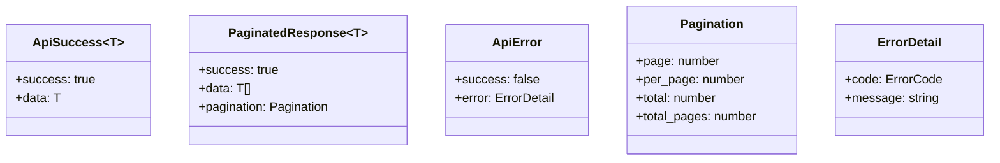
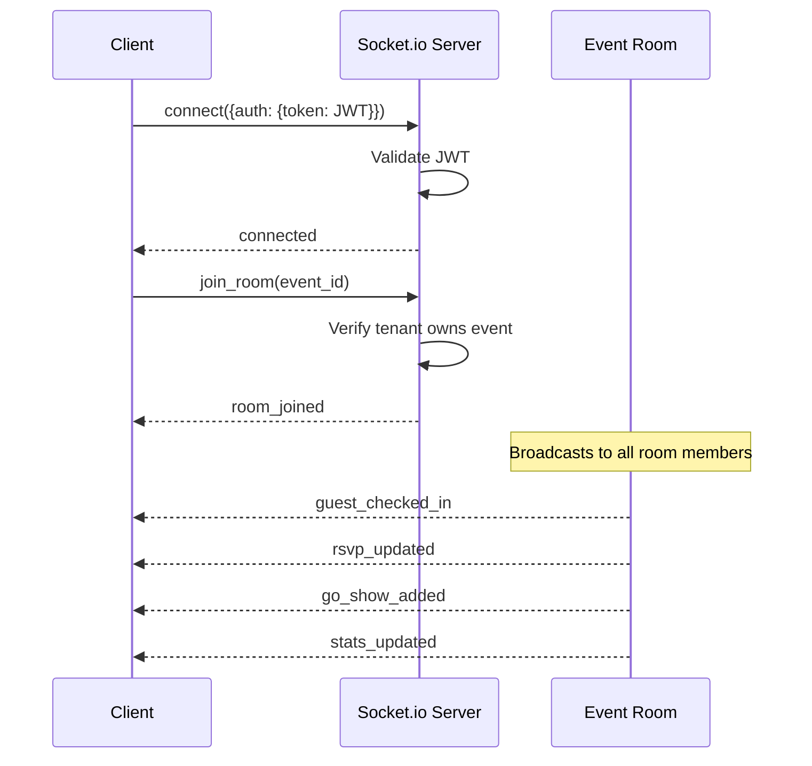
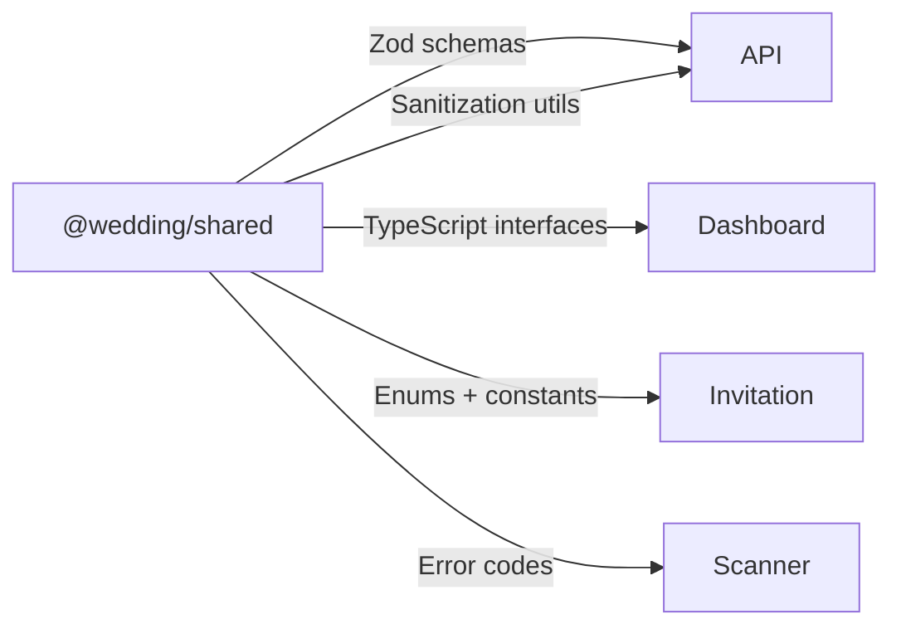
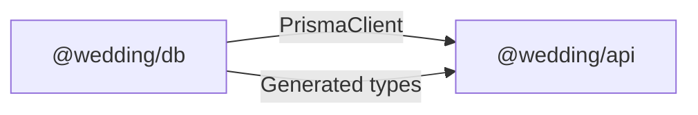
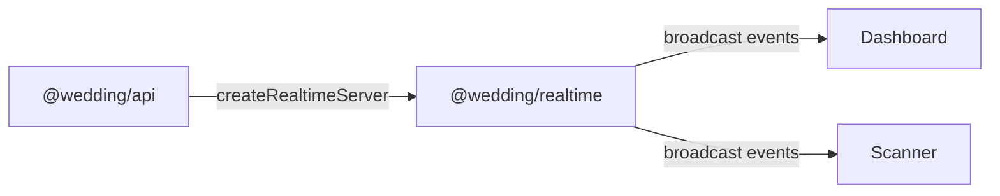

# Interfaces

## REST API Endpoints

Base URL: `http://localhost:4000` (dev) / `https://api.domain.railway.app` (prod)

### Authentication (prefix: `/auth`)

| Method | Endpoint                | Auth          | Description                                                                              |
| ------ | ----------------------- | ------------- | ---------------------------------------------------------------------------------------- |
| POST   | `/auth/login`           | None          | Login, returns JWT tokens (payload includes `sub`, `tenant_id`, `role`, `email`, `name`) |
| POST   | `/auth/refresh`         | Refresh token | Refresh access token                                                                     |
| PUT    | `/auth/profile`         | JWT           | Update client name and email                                                             |
| PUT    | `/auth/change-password` | JWT           | Change password (requires current password)                                              |

### Events (prefix: `/events`)

| Method | Endpoint                   | Auth | Description                                                                                                   |
| ------ | -------------------------- | ---- | ------------------------------------------------------------------------------------------------------------- |
| GET    | `/events/current`          | JWT  | Get current tenant's latest event                                                                             |
| POST   | `/events`                  | JWT  | Create a new wedding event                                                                                    |
| GET    | `/events/current/stats`    | JWT  | Get current event statistics                                                                                  |
| GET    | `/events/:id/stats`        | JWT  | Get event statistics (guests, RSVPs, check-ins)                                                               |
| GET    | `/events/:id/rsvp`         | JWT  | Get RSVP summary for event                                                                                    |
| POST   | `/events/:id/media/upload` | JWT  | Upload media for event (optional `?section=` param organizes R2 path: cover, gallery, story, etc.)            |
| PUT    | `/events/:id`              | JWT  | Update wedding event details (including SEO/metadata fields: share_title, share_description, share_image_url) |

### Guests (prefix: `/guests`)

| Method | Endpoint                  | Auth | Description                                                                                            |
| ------ | ------------------------- | ---- | ------------------------------------------------------------------------------------------------------ |
| GET    | `/guests`                 | JWT  | List guests (paginated, filterable)                                                                    |
| POST   | `/guests`                 | JWT  | Create guest (auto-generates QR)                                                                       |
| PUT    | `/guests/:id`             | JWT  | Update guest                                                                                           |
| DELETE | `/guests/:id`             | JWT  | Delete guest and associated QR code                                                                    |
| GET    | `/guests/:id/qr`          | JWT  | Get guest QR code (payload: `iv:ciphertext`)                                                           |
| GET    | `/guests/search`          | JWT  | Search guests by name (query: `q` min 2 chars, `event_id`)                                             |
| GET    | `/guests/groups`          | JWT  | Get unique group names in use for current event (returns presets + any custom groups)                  |
| PATCH  | `/guests/groups/reassign` | JWT  | Reassign all guests from one group to another (body: `{from, to}`) — returns updated count             |
| POST   | `/guests/import`          | JWT  | CSV bulk import (max 2000, headers: `nama`,`grup`,`telepon`,`jumlah_tamu`) — `grup` accepts any string |
| GET    | `/guests/export`          | JWT  | Export guests to CSV file (Indonesian headers matching import format + RSVP/check-in/delivery status)  |
| POST   | `/guests/bulk-delete`     | JWT  | Bulk delete guests and deactivate their QR codes                                                       |

### Check-in (prefix: `/checkin`)

| Method | Endpoint           | Auth | Description                        |
| ------ | ------------------ | ---- | ---------------------------------- |
| POST   | `/checkin/scan`    | JWT  | Verify QR scan (returns GREEN/RED) |
| POST   | `/checkin/manual`  | JWT  | Manual check-in by guest_id        |
| POST   | `/checkin/go-show` | JWT  | Register walk-in guest + check-in  |
| POST   | `/checkin/sync`    | JWT  | Sync offline check-in records      |

### Scanner Devices (prefix: `/scanner`)

| Method | Endpoint                               | Auth | Description                       |
| ------ | -------------------------------------- | ---- | --------------------------------- |
| POST   | `/scanner/devices/register`            | JWT  | Register device (max 2 per event) |
| PUT    | `/scanner/devices/:deviceId/heartbeat` | JWT  | Device heartbeat                  |
| DELETE | `/scanner/devices/:deviceId`           | JWT  | Deactivate device                 |
| GET    | `/scanner/devices/:eventId`            | JWT  | List active devices for event     |
| GET    | `/scanner/guests/:eventId`             | JWT  | Get guest cache for offline use   |

### RSVP (prefix: `/rsvp`)

| Method | Endpoint         | Auth          | Description       |
| ------ | ---------------- | ------------- | ----------------- |
| POST   | `/rsvp`          | None (public) | Submit RSVP       |
| GET    | `/rsvp/:guestId` | JWT           | Get RSVP by guest |

### CMS (prefix: `/cms`)

| Method | Endpoint                                    | Auth | Description                 |
| ------ | ------------------------------------------- | ---- | --------------------------- |
| GET    | `/cms/sections/:eventId`                    | JWT  | List all sections for event |
| GET    | `/cms/sections/:eventId/:sectionId`         | JWT  | Get specific section        |
| PUT    | `/cms/sections/:eventId/:sectionId/content` | JWT  | Update section content      |
| PUT    | `/cms/sections/:eventId/:sectionId/toggle`  | JWT  | Toggle section active       |
| PUT    | `/cms/sections/:eventId/:sectionId/reorder` | JWT  | Reorder section             |

### Invitation Deliveries (prefix: `/invitation-deliveries`)

| Method | Endpoint                                  | Auth | Description                                      |
| ------ | ----------------------------------------- | ---- | ------------------------------------------------ |
| GET    | `/invitation-deliveries/message-template` | JWT  | Get message template for event                   |
| PUT    | `/invitation-deliveries/message-template` | JWT  | Update message template for event                |
| POST   | `/invitation-deliveries/send`             | JWT  | Send single invitation via WhatsApp Web redirect |

### Messages (prefix: `/messages`)

| Method | Endpoint                          | Auth          | Description                                     |
| ------ | --------------------------------- | ------------- | ----------------------------------------------- |
| POST   | `/messages`                       | None (public) | Submit message/wish                             |
| GET    | `/messages/:eventId`              | None (public) | Get messages for event                          |
| GET    | `/messages/:eventId/admin`        | JWT           | Get all messages (visible and hidden) for event |
| PUT    | `/messages/:messageId/visibility` | JWT           | Toggle visibility of a message                  |
| DELETE | `/messages/:messageId`            | JWT           | Delete a message                                |

### Invitations (prefix: `/invitations`)

| Method | Endpoint                             | Auth | Description                                                                            |
| ------ | ------------------------------------ | ---- | -------------------------------------------------------------------------------------- |
| GET    | `/invitations/:eventSlug/:guestSlug` | None | Get personalized invitation (includes share_title, share_description, share_image_url) |
| GET    | `/invitations/:eventSlug`            | None | Get event invitation data (includes share metadata)                                    |

### Health

| Method | Endpoint  | Auth | Description                                  |
| ------ | --------- | ---- | -------------------------------------------- |
| GET    | `/health` | None | System health (PostgreSQL, Redis, WebSocket) |

### Platform Admin (prefix: `/admin`)

| Method | Endpoint                          | Auth             | Description                                                                      |
| ------ | --------------------------------- | ---------------- | -------------------------------------------------------------------------------- |
| GET    | `/admin/stats`                    | JWT (Admin role) | Get global platform KPIs (tenants, users, devices, guests)                       |
| GET    | `/admin/tenants`                  | JWT (Admin role) | List all tenants (paginated, search, subscription filter)                        |
| POST   | `/admin/tenants`                  | JWT (Admin role) | Create a new tenant with master client credentials                               |
| PATCH  | `/admin/tenants/:id/status`       | JWT (Admin role) | Toggle tenant active/inactive status                                             |
| DELETE | `/admin/tenants/:id`              | JWT (Admin role) | Delete a tenant (cascades to delete users, events, and data)                     |
| GET    | `/admin/users`                    | JWT (Admin role) | List all users across the platform (paginated, role and status filters)          |
| PATCH  | `/admin/users/:id/status`         | JWT (Admin role) | Toggle user active/inactive status (suspend/activate account)                    |
| DELETE | `/admin/users/:id`                | JWT (Admin role) | Delete a user (prevent self-deletion and admin-role deletion)                    |
| POST   | `/admin/users/admin`              | JWT (Admin role) | Create a new platform administrator                                              |
| PUT    | `/admin/users/:id/reset-password` | JWT (Admin role) | Reset user password with secure random string                                    |
| GET    | `/admin/audit-logs`               | JWT (Admin role) | List system audit logs (paginated, action, and date-range filters)               |
| GET    | `/admin/tenants/:id/events`       | JWT (Admin role) | List all events of a tenant with their limit configurations                      |
| PATCH  | `/admin/events/:eventId/config`   | JWT (Admin role) | Update event config limits (max_guests, max_scanner_devices, max_gallery_photos) |

### Detailed Event Statistics Payload

The endpoints `GET /events/current/stats` and `GET /events/:id/stats` return a comprehensive analytics payload:

```json
{
  "total_guests": 25,
  "total_rsvp": 15,
  "total_checked_in": 5,
  "total_go_show": 0,
  "rsvp_confirmed": 12,
  "rsvp_declined": 3,
  "rsvp_pending": 10,
  "total_pax_invited": 50,
  "total_pax_confirmed": 24,
  "attendance_akad": 4,
  "attendance_resepsi": 6,
  "attendance_both": 2,
  "checked_in_invited": 5,
  "checked_in_go_show": 0,
  "delivery_sent": 10,
  "delivery_not_sent": 14,
  "delivery_failed": 1,
  "vip_total": 5,
  "vip_confirmed": 4,
  "vip_checked_in": 2,
  "total_wishes": 8,
  "visible_wishes": 6,
  "rsvp_trend": [
    { "date": "2026-05-28", "count": 2 },
    { "date": "2026-05-29", "count": 15 }
  ],
  "checkin_peak": [
    { "timeSlot": "09:00", "count": 1 },
    { "timeSlot": "09:30", "count": 4 }
  ],
  "group_breakdown": {
    "Keluarga": { "total": 10, "confirmed": 8, "declined": 1, "pending": 1, "checked_in": 4 },
    "Teman": { "total": 5, "confirmed": 2, "declined": 1, "pending": 2, "checked_in": 1 },
    "Rekan Kerja": { "total": 5, "confirmed": 1, "declined": 1, "pending": 3, "checked_in": 0 },
    "VIP": { "total": 5, "confirmed": 4, "declined": 0, "pending": 1, "checked_in": 2 }
  }
}
```

## API Response Format



## WebSocket Interface

**Connection**: `wss://api.domain/` with JWT in handshake auth



### WebSocket Events

| Event              | Direction     | Payload                                                | Description              |
| ------------------ | ------------- | ------------------------------------------------------ | ------------------------ |
| `guest_checked_in` | Server→Client | `{guest_id, guest_name, group, method, checked_in_at}` | Guest checked in         |
| `rsvp_updated`     | Server→Client | `{guest_id, attendance, guest_count}`                  | RSVP submitted/updated   |
| `go_show_added`    | Server→Client | `{guest_id, guest_name}`                               | Walk-in guest registered |
| `stats_updated`    | Server→Client | `EventStats`                                           | Aggregated stats refresh |
| `join_room`        | Client→Server | `event_id`                                             | Join event room          |
| `leave_room`       | Client→Server | `event_id`                                             | Leave event room         |

## Invitation URL Interface

Public URL pattern: `/{event-slug}?to={guest-slug}`

- `event-slug`: Unique event identifier (e.g., `andi-sari-wedding`)
- `guest-slug`: Guest name slugified (e.g., `budi-santoso`)
- The `to` parameter personalizes the cover with the guest's name
- No authentication required

## Internal Package Interfaces

### Shared → All Packages



### DB → API



### Realtime → API + Frontend



## Error Code Interface

The platform uses a centralized `ErrorCode` enum in `@wedding/shared` for standardized error handling across all apps. All API errors return a `4xx` or `5xx` status code with a consistent JSON envelope:

```json
{
  "success": false,
  "error": {
    "code": "AUTH_INVALID_CREDENTIALS",
    "message": "Email atau password tidak valid",
    "details": []
  }
}
```

### Common Error Codes

| Category             | Prefix    | Examples                                                                    |
| -------------------- | --------- | --------------------------------------------------------------------------- |
| **Authentication**   | `AUTH_`   | `INVALID_CREDENTIALS`, `ACCOUNT_LOCKED`, `SESSION_EXPIRED`, `TOKEN_EXPIRED` |
| **Validation**       | `VAL_`    | `VALIDATION_FAILED` (Standard Zod error response)                           |
| **Authorization**    | `ROLE_`   | `ROLE_INSUFFICIENT` (RBAC failure)                                          |
| **Tenant Isolation** | `TENANT_` | `TENANT_ACCESS_DENIED`, `TENANT_NOT_FOUND`                                  |
| **Domain: Guest**    | `GUEST_`  | `GUEST_NOT_FOUND`, `GUEST_ALREADY_EXISTS`, `IMPORT_FAILED`                  |
| **Domain: Event**    | `EVENT_`  | `EVENT_NOT_FOUND`, `EVENT_NOT_PUBLISHED`                                    |
| **Domain: Check-in** | `SCAN_`   | `ALREADY_CHECKED_IN`, `INVALID_QR_PAYLOAD`, `DEVICE_NOT_FOUND`              |
| **System**           | `SYS_`    | `INTERNAL_ERROR`, `DATABASE_ERROR`, `RATE_LIMIT_EXCEEDED`                   |
| **Storage**          | `STOR_`   | `STORAGE_QUOTA_EXCEEDED`, `UPLOAD_FAILED`                                   |
