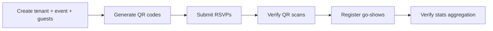

# Testing

## Overview

- **Unit/Integration Framework**: Vitest 3.2.4
- **E2E Testing Framework**: Playwright 1.55.1 (API & Socket.io WebSocket)
- **Property-Based Testing**: fast-check 4.8.0
- **Total Tests**: ~1218 + 14 Playwright E2E cases across all packages
- **Coverage Target**: 80% minimum for business logic

## Test Distribution

| Package | Tests | Type |
|---------|-------|------|
| `@wedding/api` | ~924 + 14 E2E | Unit + Integration + Property-based + Playwright E2E |
| `@wedding/shared` | ~63 | Unit + Property-based |
| `@wedding/realtime` | ~87 | Unit + Integration + Property-based |
| `@wedding/dashboard` | ~81 | Unit + Property-based |
| `@wedding/invitation` | ~32 + 14 UI | Unit + Property-based + Playwright UI Smoke Tests |
| `@wedding/scanner` | ~43 | Unit + Property-based |

## Running Tests

```bash
# All unit/integration tests
npm run test

# Playwright E2E tests (specifically for @wedding/api / @wedding/realtime)
npm run test:e2e --workspace=packages/api

# Playwright UI smoke tests for invitation application (mobile/desktop viewports)
npx playwright test --config=apps/invitation/playwright.config.ts

# Per package (unit tests)
npx turbo test --filter=@wedding/api
npx turbo test --filter=@wedding/shared
npx turbo test --filter=@wedding/realtime
npx turbo test --filter=@wedding/dashboard
npx turbo test --filter=@wedding/invitation
npx turbo test --filter=@wedding/scanner
```

## Test File Conventions

- **Local Grouping**: Test files are co-located with their source in a feature subfolder: `src/{layer}/{feature}/{name}.test.ts`
- Property-based tests: `src/{layer}/{feature}/{name}.property.test.ts`
- Integration tests: `tests/integration/{name}.integration.test.ts`

## Patterns

### 1. Two-Level Mocking Strategy

The Guest domain uses a **3-layer architecture** (route → service → repository), which requires two distinct mocking strategies:

#### Level 1 — Service tests: mock the repository interface

Services are defined with a repository interface (e.g., `GuestRepository`). Tests inject a mock that implements the interface:

```typescript
// Interface defined in guest.service.ts
export interface GuestRepository {
  findById(id: string, tenantId: string): Promise<GuestRecord | null>;
  create(data: CreateGuestData): Promise<GuestRecord>;
  // ...
}

// Mock in guest.service.test.ts
function createMockRepository(): GuestRepository {
  return {
    findById: vi.fn(),
    create: vi.fn(),
    // ...
  };
}
```

#### Level 2 — Repository tests: mock PrismaClient

Repository tests (`guest.repository.test.ts`) create a typed mock of the Prisma model delegate and assert that every call includes `tenant_id` in the `where` clause:

```typescript
const mockPrisma = {
  guest: {
    findMany: vi.fn(),
    findUnique: vi.fn(),
    create: vi.fn(),
    update: vi.fn(),
    delete: vi.fn(),
  },
} as unknown as PrismaClient;

it('should always scope queries by tenant_id', async () => {
  await repo.findById('guest-1', 'tenant-1');
  expect(mockPrisma.guest.findUnique).toHaveBeenCalledWith(
    expect.objectContaining({ where: expect.objectContaining({ tenant_id: 'tenant-1' }) })
  );
});
```

**Rule**: If a domain does **not** yet have a `*.repository.ts` file, use Level 1 only (mock in service test). Once migrated, add Level 2 tests.

### 2. Modular Mocking Pattern (@wedding/db)

When testing routes or plugins that depend on database connections (e.g., `audit-logger`), mock the `@wedding/db` package to avoid `DATABASE_URL` requirements during unit testing:

```typescript
vi.mock('@wedding/db', () => ({
  createProductionPrismaClient: vi.fn(() => ({
    $connect: vi.fn().mockResolvedValue(undefined),
    $disconnect: vi.fn().mockResolvedValue(undefined),
    auditLog: {
      create: vi.fn().mockResolvedValue({ id: 'log-1' }),
    },
  })),
}));
```

Always ensure the mock path in `vi.mock` exactly matches the import path to avoid `mockReturnValue is not a function` errors.

### 3. Factory Functions for Test Data

Each test file defines factory functions with sensible defaults and override support:

```typescript
function createMockGuest(overrides: Partial<GuestForRsvp> = {}): GuestForRsvp {
  return {
    id: 'guest-001',
    event_id: 'event-001',
    tenant_id: 'tenant-001',
    name: 'John Doe',
    plus_one_count: 2,
    ...overrides,
  };
}
```

### 3. Property-Based Testing with fast-check

Used to verify invariants hold across random inputs. Common pattern:

```typescript
import fc from 'fast-check';

// Define arbitraries (random data generators)
const arbGuestId = fc.uuid();
const arbGuestGroup = fc.constantFrom(
  GuestGroup.FAMILY, GuestGroup.FRIEND, GuestGroup.COLLEAGUE, GuestGroup.VIP
);
const arbGuestName = fc.string({ minLength: 1, maxLength: 50 })
  .filter((s) => s.trim().length > 0);

// Property test
it('should never create duplicate check-in records', () => {
  fc.assert(
    fc.property(arbGuestId, arbEventId, arbAttemptCount, (guestId, eventId, attempts) => {
      // Setup in-memory repository
      const repo = createInMemoryRepository();
      const service = new CheckInService(repo, redis, encryptionKey);

      // First attempt succeeds
      const first = service.verifyQRScan(payload);
      expect(first.status).toBe(VerificationStatus.VALID);

      // Subsequent attempts return DUPLICATE
      for (let i = 1; i < attempts; i++) {
        const result = service.verifyQRScan(payload);
        expect(result.status).toBe(VerificationStatus.DUPLICATE);
      }
    })
  );
});
```

### 4. In-Memory Implementations for Integration

Property tests use in-memory implementations instead of mocks for realistic behavior:

```typescript
function createInMemoryRepository() {
  const guests = new Map<string, GuestInfo>();
  const checkIns = new Map<string, CheckInRecord[]>();

  return {
    findGuestById: async (id: string) => guests.get(id) ?? null,
    findCheckInsByGuestId: async (guestId: string) => checkIns.get(guestId) ?? [],
    createCheckIn: async (data: CreateCheckInInput) => {
      const records = checkIns.get(data.guest_id) ?? [];
      const record = { id: randomUUID(), ...data, checked_in_at: new Date() };
      records.push(record);
      checkIns.set(data.guest_id, records);
      return record;
    },
  };
}
```

### 5. Middleware Testing

Middleware tests use mock request/reply objects:

```typescript
function createMockRequest(overrides = {}) {
  return { headers: {}, body: {}, params: {}, query: {}, ...overrides };
}

function createMockReply() {
  const reply = {
    statusCode: 200,
    sent: false,
    status: vi.fn().mockReturnThis(),
    send: vi.fn().mockImplementation(() => { reply.sent = true; return reply; }),
    header: vi.fn().mockReturnThis(),
  };
  return reply;
}
```

### 6. WebSocket/Real-time Testing

Integration tests create actual Socket.io client connections:

```typescript
function createClientSocket(port: number, token: string) {
  return io(`http://localhost:${port}`, {
    auth: { token },
    transports: ['websocket'],
  });
}

function waitForEvent(socket: Socket, event: string, timeout = 5000) {
  return new Promise((resolve, reject) => {
    const timer = setTimeout(() => reject(new Error('Timeout')), timeout);
    socket.once(event, (data) => { clearTimeout(timer); resolve(data); });
  });
}
```

## Property-Based Test Coverage

| Domain | Properties Verified |
|--------|-------------------|
| QR Validation | Encrypted payload always decryptable; invalid payloads always rejected; tampered payloads detected |
| Check-in Idempotency | Multiple scans of same QR never create duplicate records; first returns VALID, rest return DUPLICATE |
| RSVP Processing | Guest count never exceeds capacity; attendance type always valid; upsert is idempotent |
| Tenant Isolation | Queries with wrong tenant_id always return empty/forbidden; cross-tenant data never leaks |
| Offline Sync | All queued items eventually synced; server timestamp wins on conflict; no data loss |
| Room Isolation | Events broadcast only to correct room; joining wrong room is rejected |
| CMS Sort Order | Reordering always produces valid sequential sort_order; no gaps or duplicates |
| Scanner Device | Max 2 devices enforced regardless of registration order; lane assignment is deterministic |
| Go-Show | Go-show guests always get type=go_show and method=go_show; never assigned QR codes |
| Invitation Delivery | Custom template compilation; delivery status tracking ('sent'); WhatsApp Web URL compilation |

## Integration Test Patterns

The `end-to-end-flows.integration.test.ts` file tests complete workflows:



Tests verify that:
- State changes propagate correctly across services
- Real-time broadcasts fire with correct payloads
- Stats are accurately recalculated after each operation
- Tenant isolation holds throughout the entire flow

## Vitest Configuration

Each package has its own `vitest.config.ts`. To isolate Vitest from Playwright E2E test files (which import `@playwright/test` and cause environment/compilation conflicts), Playwright tests are excluded from Vitest via the `exclude` configuration option:

```typescript
import { defineConfig, configDefaults } from 'vitest/config';

export default defineConfig({
  test: {
    globals: false,        // Explicit imports (describe, it, expect)
    environment: 'node',   // Node environment (backend packages)
    exclude: [...configDefaults.exclude, 'tests/e2e/**/*'], // Exclude Playwright tests
    // environment: 'jsdom' // For frontend packages
  },
});
```

## E2E Playwright Configuration

Playwright is configured under `packages/api/playwright.config.ts`. It manages starting the backend server synchronously using the `webServer` config block, targets the dedicated test database, and runs the E2E specs in sequential mode to ensure database integrity during test state assertions.

## E2E Playwright UI Configuration (Invitation App)

Playwright is configured under `apps/invitation/playwright.config.ts` for running mobile-first UI smoke tests against the invitation web app. It targets the local Next.js dev server on port `3001` (reusing it if running), using a mobile Chrome viewport (iPhone 14) and desktop Chrome, saving screenshot results to `test-results/` for inspection.

## E2E Testing Validation Rules

Whenever a new feature is added or a new capability is introduced:
1. **Mandatory E2E Check**: Write or update E2E tests under `packages/api/tests/e2e` to verify the user flows and backend integration. Run the suite sequentially:
   ```bash
   npm run test:e2e --workspace=packages/api
   ```
2. **Exemption Rule**: If the change is a minor improvement, styling fix, typo correction, or documentation update that does not introduce or alter any system/user flows or integration points, writing/executing E2E tests is not required.
